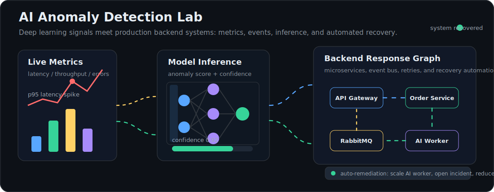
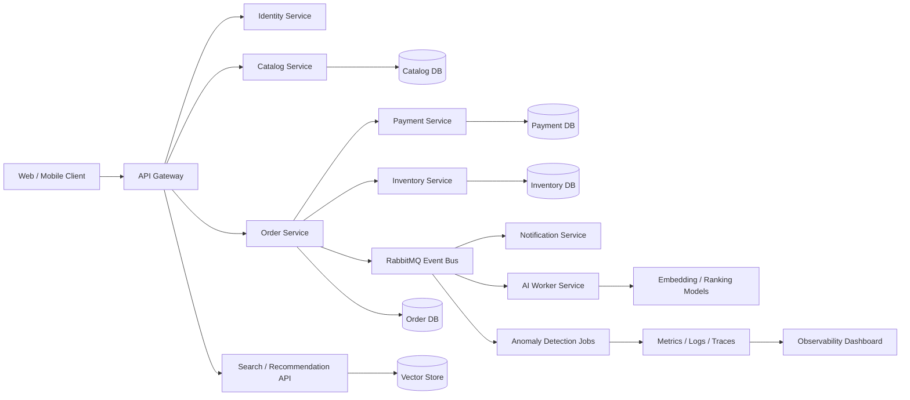

# Burhan Cabiroglu

### Backend Software Engineer | Spring Boot Microservices | AI Engineer

I build production backend systems where reliability matters: Java/Spring Boot microservices, distributed services, financial application flows, message-driven architectures, CI/CD automation, and observability-heavy production support. Alongside my backend focus, I work on AI engineering patterns such as model-serving APIs, embeddings, recommendation workflows, anomaly detection, RAG pipelines, and intelligent automation.

---

  

## What I Focus On

- Java and Spring Boot microservices with REST APIs, service discovery, Spring Security, RabbitMQ, Docker, and PostgreSQL
- Backend services with C#, .NET, Node.js, GraphQL, CQRS, MediatR, and production-oriented API design
- Distributed systems with RabbitMQ, event-driven flows, offline synchronization, recovery mechanisms, and resilient service boundaries
- Databases with PostgreSQL, MySQL, schema design, query optimization, and transaction-oriented workflows
- Production delivery with Docker, Jenkins, CI/CD, Git workflows, structured logging, Serilog, and ELK
- AI engineering with model-serving APIs, embeddings, recommendation systems, anomaly detection, RAG pipelines, async AI jobs, and agentic workflows

## Current Work

I am currently building production backend services with C#, .NET, PostgreSQL, MySQL, RabbitMQ, Jenkins, and React. My recent work includes asynchronous communication flows, offline sync and recovery mechanisms, CI/CD automation, and structured logging for production troubleshooting.

Previously, I worked on financial applications across banking, factoring, international banking, marketplace, and enterprise platforms.

## AI Engineering

My main professional foundation is backend engineering, especially Java/Spring Boot microservices. I extend that foundation with AI engineering: data pipelines, embeddings, recommendation systems, anomaly detection, model-serving APIs, async inference workflows, and LLM/RAG integrations that can run reliably inside production systems.

## Featured Systems

| Project | What it shows | Stack |
| --- | --- | --- |
| [Ticket Microservice](https://github.com/burhancabiroglu/TicketMicroservice) | Java microservices, service discovery, async messaging, mail flows, and containerized infrastructure | Java, Spring Boot, Eureka, Spring Security, RabbitMQ, Docker, PostgreSQL |
| [Cabir CRM](https://github.com/burhancabiroglu/cabir-crm) | Full-stack CRM with clean backend structure, auth, CQRS, and production-style deployment thinking | Next.js, TypeScript, .NET 8, PostgreSQL, MediatR, CQRS, JWT |
| [Transportation Server System](https://github.com/burhancabiroglu/transport-reservation-server) | Reservation backend with authentication and operational data flows | TypeScript, NestJS, PostgreSQL, JWT, React, Docker |

## Flagship Direction

The next public project I am shaping is a larger, real microservice application: an AI commerce and operations platform with identity, catalog, order, payment, inventory, notification, recommendation, anomaly detection, and observability services.

The goal is to demonstrate production-grade backend thinking and AI engineering in one system: service boundaries, RabbitMQ events, PostgreSQL ownership per service, Docker Compose local infrastructure, gateway routing, structured logs, async model inference, recommendation jobs, anomaly detection, and observability.

## Architecture Snapshot

## Tech Stack

  

## Interactive Systems Thinking

The animated lab above represents the kind of systems I like building and studying: backend telemetry flowing into anomaly detection, model inference producing confidence scores, events moving through RabbitMQ, and automated recovery actions keeping distributed services healthy.

## GitHub Activity

  
  

## Open To

- Backend Software Engineer roles
- Java / Spring Boot backend roles
- Distributed systems, financial systems, and production platform teams
- International relocation opportunities
