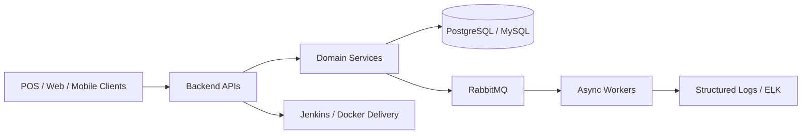

# Burhan Cabiroglu

### Backend Software Engineer | Java, Spring Boot, .NET, Microservices, Distributed Systems

I build production backend systems where reliability matters: distributed POS platforms, financial application flows, message-driven services, CI/CD automation, and observability-heavy production support.

---

## What I Focus On

- Backend services with Java, Spring Boot, C#, .NET, Node.js, REST APIs, GraphQL, CQRS, and MediatR
- Distributed systems with RabbitMQ, event-driven flows, offline synchronization, and recovery mechanisms
- Databases with PostgreSQL, MySQL, schema design, query optimization, and transaction-oriented workflows
- Production delivery with Docker, Jenkins, CI/CD, Git workflows, structured logging, Serilog, and ELK
- AI-era engineering: practical systems thinking, automation, observability, and backend foundations for intelligent products

## Current Work

I am currently working on distributed POS systems, building backend services and deployment automation across large cash register environments. My recent work includes RabbitMQ communication flows, offline sync and recovery, CI/CD automation, and structured logging for production troubleshooting.

Previously, I worked on financial applications across banking, factoring, international banking, marketplace, and enterprise platforms.

## Featured Systems

| Project | What it shows | Stack |
| --- | --- | --- |
| [Cabir CRM](https://github.com/burhancabiroglu/cabir-crm) | Full-stack CRM with clean backend structure, auth, CQRS, and production-style deployment thinking | Next.js, TypeScript, .NET 8, PostgreSQL, MediatR, CQRS, JWT |
| [Ticket Microservice](https://github.com/burhancabiroglu/TicketMicroservice) | Java microservices, service discovery, async messaging, mail flows, and containerized infrastructure | Java, Spring Boot, Eureka, Spring Security, RabbitMQ, Docker, PostgreSQL |
| [Transportation Server System](https://github.com/burhancabiroglu/transport-reservation-server) | Reservation backend with authentication and operational data flows | TypeScript, NestJS, PostgreSQL, JWT, React, Docker |

## Architecture Snapshot

## Tech Stack

  

## Backend Mini-Game

I am experimenting with a small browser game that turns backend reliability into a playable system: route events through services, protect the queue, and keep latency under control.

Play it here after GitHub Pages is enabled:

**https://burhancabiroglu.github.io/burhancabiroglu/game/**

## GitHub Activity

<picture>
  <source media="(prefers-color-scheme: dark)" srcset="https://raw.githubusercontent.com/burhancabiroglu/burhancabiroglu/output/github-contribution-grid-snake-dark.svg" />
  <source media="(prefers-color-scheme: light)" srcset="https://raw.githubusercontent.com/burhancabiroglu/burhancabiroglu/output/github-contribution-grid-snake.svg" />
  
</picture>

  
  

## Open To

- Backend Software Engineer roles
- Java / Spring Boot backend roles
- Distributed systems, financial systems, and production platform teams
- International relocation opportunities

